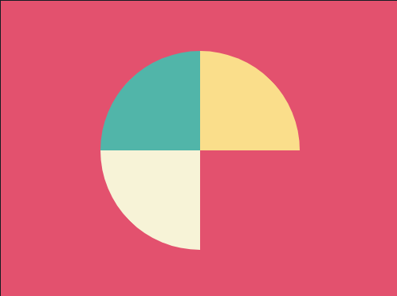

```css
<style>*{background:#E3516E}*>*{height:0;width:0;margin:50 auto;border:100px solid transparent;border-top-color:#FADE8B;border-bottom-color:#F7F3D7;border-left-color:#51B5A9;border-radius:50%;transform:rotate(45deg)
```

